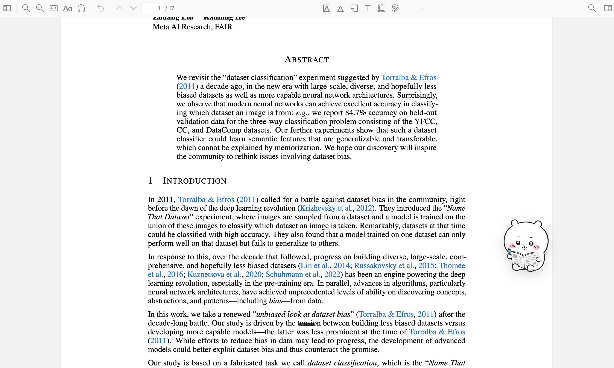
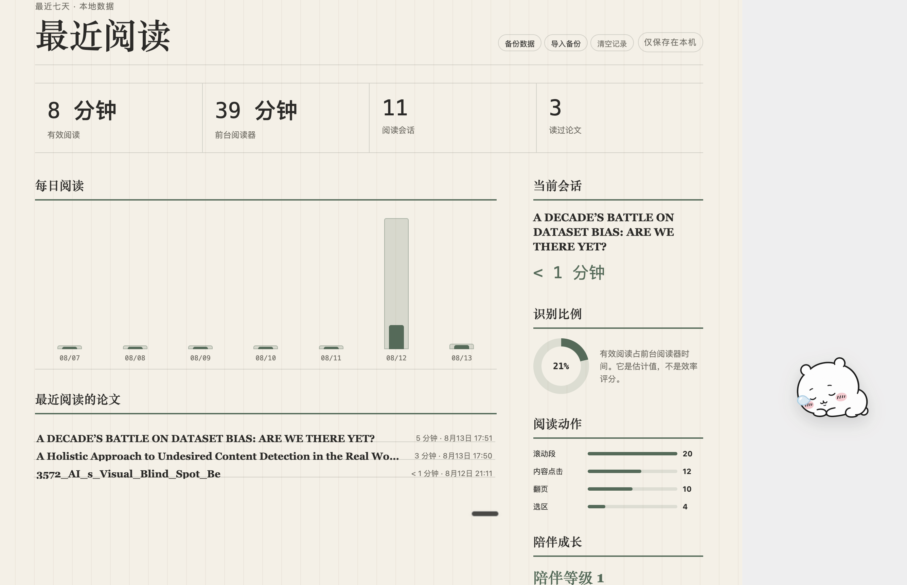
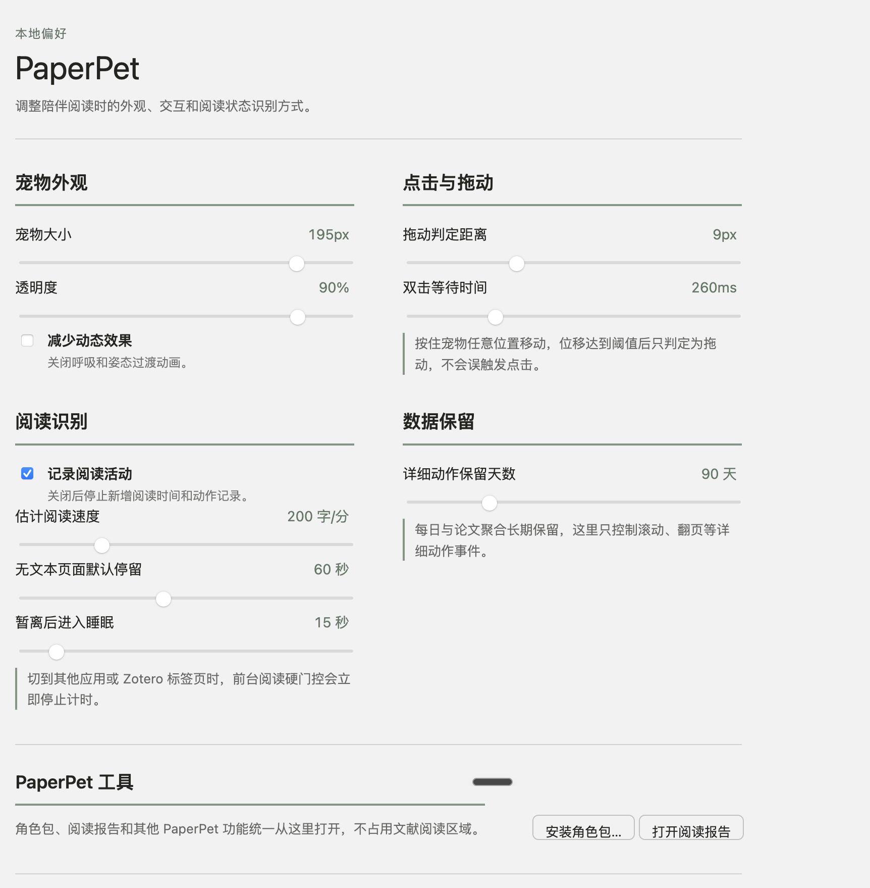

# PaperPet

让 Zotero 的每一次阅读，都有一个安静的陪伴。

PaperPet 是一款运行在 Zotero 桌面端的阅读伴侣。它住在 Zotero 窗口右下角，会根据你的阅读动作调整状态，也会把阅读过程整理成轻量、可回看的记录。

[下载 PaperPet](https://github.com/howarddong711/PaperPet/releases) · [查看全部版本](https://github.com/howarddong711/PaperPet/releases)

## 阅读中的陪伴

PaperPet 会观察窗口前台状态、滚动、翻页、选区和批注等信号，识别当前更接近哪一种阅读状态。宠物会在阅读、思考、快速浏览、批注、暂离和睡眠之间自然切换。

- 宠物可以在整个 Zotero 窗口内移动
- 按住宠物的任意位置即可拖动，点击宠物可以获得轻量互动反馈
- 长时间没有阅读动作时会进入休息状态，回到文档后再重新陪伴
- 所有识别都在本地完成，不会打断 PDF 阅读

## 阅读报告

阅读报告放在 Zotero 的 PaperPet 设置页中。它以最近七天为默认范围，展示有效阅读时间、前台阅读时间、阅读会话、读过的论文、每日阅读柱状图、识别比例和阅读动作分布。

报告还可以查看单篇论文和具体会话，支持排除误触产生的记录，也支持把本地数据备份成 JSON 文件后再恢复。

PaperPet 不设置阅读目标、效率评分、排行榜或惩罚性连续签到。数字用于帮助你回看阅读过程，不用于评价你。

## 原生设置页

安装后，在 Zotero 的“设置”窗口左侧打开 PaperPet。宠物、阅读识别、数据保留、角色包和报告入口都集中在这里。

可以调整的项目包括

- 宠物大小、透明度和显示位置
- 点击与拖动判定、双击间隔和拖动灵敏度
- 阅读识别开关、有效阅读阈值、默认阅读速度和睡眠延迟
- 动作事件的保留时间，以及是否记录滚动、翻页、选区和批注
- 角色包安装、阅读报告、数据备份与恢复

## 角色包

PaperPet 使用声明式的 `.zpet` 角色包。角色的图片、动作状态、尺寸和展示规则彼此分离，后续可以加入原创角色，也可以支持用户制作自己的角色包。

角色包从 PaperPet 设置页安装。安装过程会检查包的结构、版本和资源范围，不执行角色包中的脚本。首版角色包格式见 [角色包格式说明](docs/character-pack.schema.json)。

想制作自己的角色，可以参考 [自定义角色包指南](docs/character-pack-creation.md)。指南提供了文件结构、manifest 模板、动作映射、打包方式和安装测试步骤。

仓库提供了一个可以直接安装的完整示例包 [Chiikawa Study Companion](examples/character-packs/chiikawa-study-companion.zpet)。它包含待机、阅读、思考、批注、睡眠和暂离六种静态动作，安装说明与素材声明见 [示例角色包说明](examples/character-packs/README.md)。

### 六种示例动作

<table>
  <tr>
    <td align="center" width="33%">
      
       待机 <code>idle</code>
    </td>
    <td align="center" width="33%">
      
       阅读 <code>reading</code>
    </td>
    <td align="center" width="33%">
      
       思考 <code>thinking</code>
    </td>
  </tr>
  <tr>
    <td align="center" width="33%">
      
       批注 <code>annotating</code>
    </td>
    <td align="center" width="33%">
      
       睡眠 <code>sleeping</code>
    </td>
    <td align="center" width="33%">
      
       暂离 <code>away</code>
    </td>
  </tr>
</table>

## 数据与隐私

PaperPet 的阅读会话、动作事件、设置和报告数据默认只保存在 Zotero 数据目录下的本地 SQLite 数据库中。当前版本不提供云同步，也不会把论文标题、划线或笔记发送到外部服务。

报告中的“有效阅读时间”是根据交互、视口和文档内容估计出的阅读信号，属于阅读过程的近似记录。它不等同于眼动仪测得的注视时间，也不承担效率评分的作用。模型会优先使用滚动、翻页、选区和批注等真实阅读动作，并合并短暂的停顿，减少把自然思考误判成离开。

## 安装与开始使用

PaperPet 支持 Zotero 9 桌面端，适用于 macOS、Windows 和 Linux。

1. 从 [GitHub Releases](https://github.com/howarddong711/PaperPet/releases) 下载最新的 `PaperPet.xpi`。
2. 打开 Zotero，进入“工具 → 插件”。
3. 点击右上角齿轮按钮，选择“从文件安装插件”，再选择下载的 XPI 文件。
4. 安装完成后打开“Zotero → 设置 → PaperPet”，调整宠物和阅读识别参数。
5. 打开一篇 PDF 开始阅读。阅读报告和角色包安装都可以从同一个设置页进入。

## 常见问题

### 宠物为什么会睡着

PaperPet 会根据最近一段时间的阅读动作判断你是否仍在阅读。停留、滚动、翻页、选区和批注都会帮助它保持清醒，长时间没有信号时它会进入睡眠姿态。睡眠延迟和识别阈值可以在设置页调整。

### 宠物拖不动怎么办

请按住宠物本身的任意位置再移动鼠标。点击和拖动使用不同的判定阈值，轻点会触发互动，移动超过阈值后才会开始拖动。

### 报告为什么还是空的

需要先在 Zotero 的 PDF 阅读器中打开一篇论文。PaperPet 会在会话结束或窗口失去焦点后整理记录，刚开始阅读时报告可能仍显示为零。

### 可以删除或备份记录吗

可以。在 PaperPet 设置页打开阅读报告，可以备份本地 JSON、导入备份，也可以清空全部记录。数据始终由你自己掌握。

## 当前版本

PaperPet 0.3.0 已提供阅读陪伴、状态识别、阅读记录、可视化报告、可拖动宠物、原生设置页和声明式角色包框架。

日报、周报、月报和年报不属于当前版本。节日限定的年度回顾会在后续版本中基于本地统计数据生成，并在获得用户明确授权后使用 LLM 完成叙事。

## 许可

当前仓库尚未附加开源许可证。除 GitHub 正常浏览、下载与安装本项目发布包外，不授予复制、修改或再分发源码的许可。
